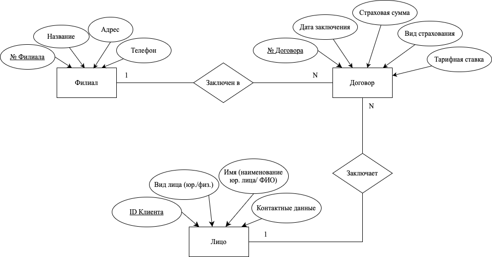
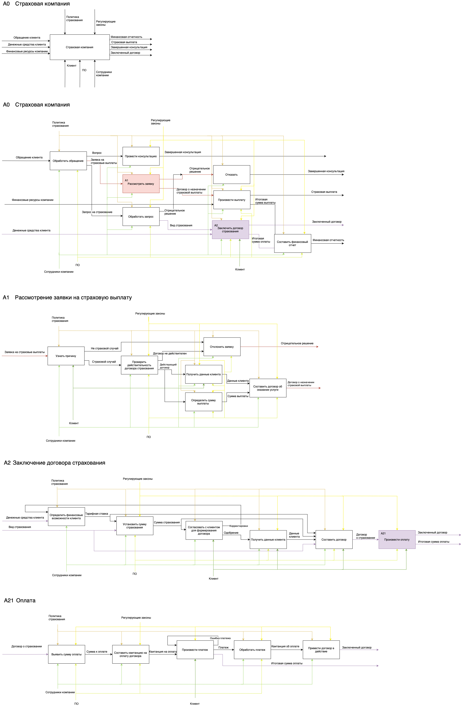
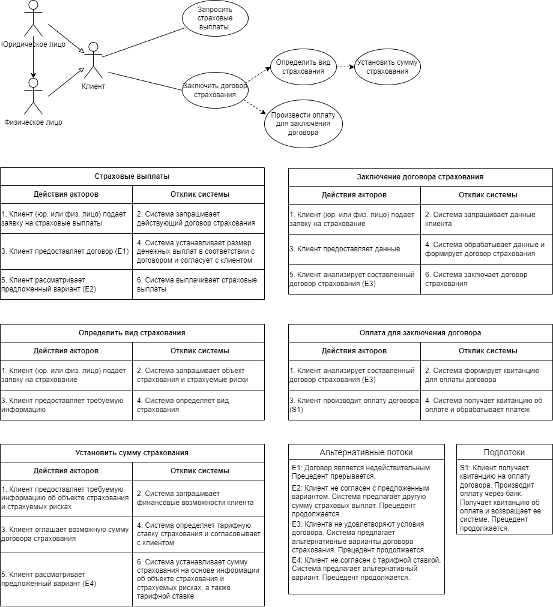

Using a database in an insurance company

В данной проекте используется SQLite для хранения договоров и клиентов в базе данных. 

Для создания программного модуля, имитирующего работу страховой компании, была спроектирована информационная система. 

